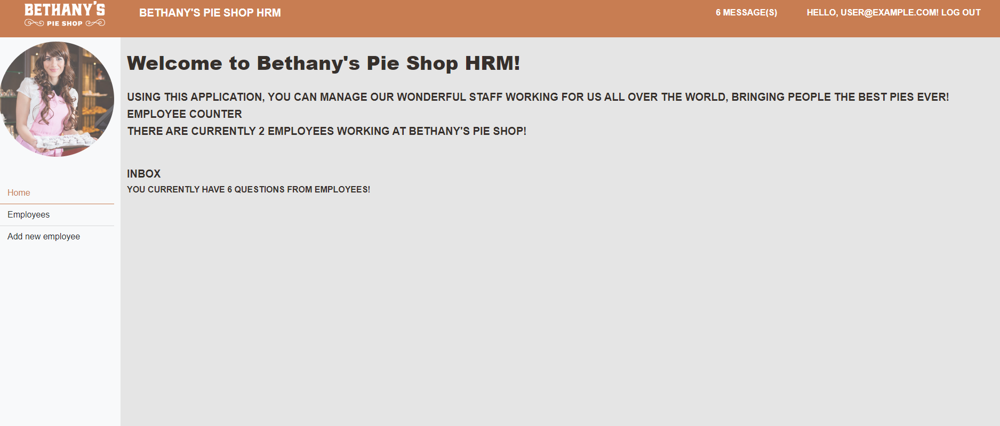
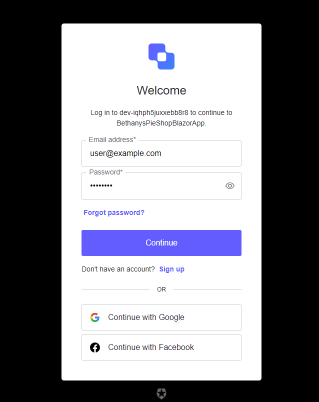
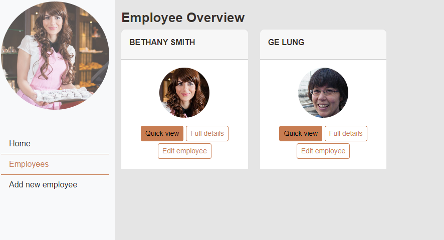
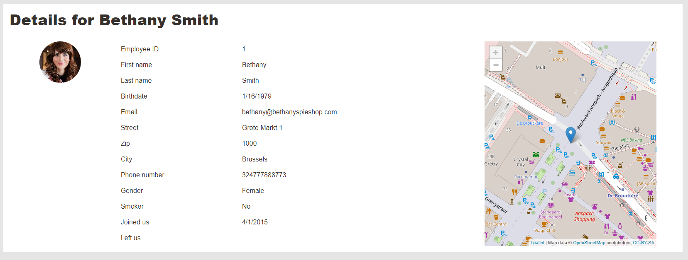

# Bethany's Pie Shop HRM
A full-stack HRM web application using Blazor ASP.NET Core, allowing users to add, manage, or delete employees. It integrates SQL Server with Entity Framework Core to manage and persist application data efficiently. It also implements a secure authentication and authorization system, enabling role-based access control and protecting user data. The final application was deployed to Azure App Service, ensuring seamless and scalable online availability.

 

      
     
     
     

## Technologies used:

* C#
* ASP.NET Core
* Blazor
* Entity Framework
* SQL
* API
* Razor
* Identity
* OOP
* UI

## Credits:

This is a project I made based on Gill Cleeren's course on [ASP.NET Core 6 Blazor Fundamentals](https://app.pluralsight.com/library/courses/asp-dot-net-core-6-blazor-fundamentals/table-of-contents).
